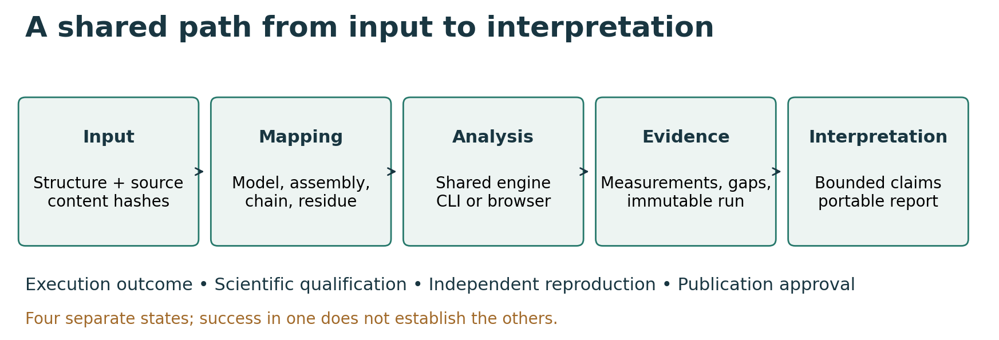
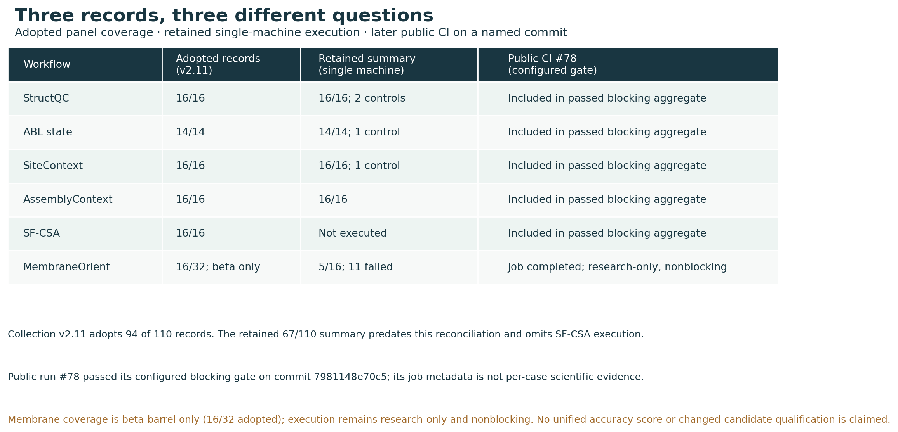

# Summary

Researchers often need to assess several kinds of evidence before interpreting a
protein structure. YAUVI Structural Workbench brings those records into a local
Python suite and browser interface for six structural-protein questions: coordinate identity and
quality, membrane orientation, conformational resemblance, functional-site
context, biological assembly interfaces, and comparative structural/sequence
relationships. Each analysis remains an independently installable command-line
package. The workbench creates typed configurations, verifies files by SHA-256,
invokes the registered command, and renders its JSON and tabular evidence into a
readable, printable report.

The central design constraint is that evidence dimensions are not collapsed into
a universal protein or function score. Unknown provenance remains unknown;
active-like describes coordinate resemblance rather than biochemical activity;
an annotated catalytic site is not observed catalysis; and a shared fold is not
exact functional transfer. Missing references, mappings, runtimes, or validation
reports remain visible as missing or scientifically incomplete evidence.

# Statement of need

Structural bioinformatics typically requires moving between coordinate
validation, residue numbering systems, sequence annotations, reference
conformations, biological assemblies, surface areas, and similarity searches.
Author and label residue identities in PDBx/mmCIF are particularly important
when a measurement must trace back to an exact sequence position. Community
validation systems such as wwPDB and MolProbity provide essential model-quality
evidence [@wwpdb; @molprobity], while Gemmi provides robust macromolecular format
support [@gemmi]. However, these results are often reviewed in separate tools,
and missing evidence can be mistaken for a favorable or negative result.

YAUVI provides one reproducible case boundary while leaving scientific
calculations in standalone packages. It is intended for structural biologists,
bioinformaticians, and trainees who need inspectable evidence and explicit claim
limits rather than an opaque ranking. The same deterministic reports can support
method development, target characterization, comparison of experimental and
predicted structures, and planning of follow-up validation without generating a
wet-lab protocol.

# State of the field and build-versus-contribute justification

Existing programs already provide stronger specialist calculations than a new
implementation should attempt to replace. Gemmi supplies standards-aware
coordinate parsing [@gemmi]; wwPDB and MolProbity supply community model
validation [@wwpdb; @molprobity]; OPM/PPM supplies a richer membrane-positioning
reference system [@opm]; and Foldseek and DIAMOND supply established structure
and sequence searches [@foldseek; @diamond]. YAUVI therefore invokes or imports
these methods through named adapters and preserves their scores, parameters,
units, versions, and limitations rather than reimplementing them.

Broader libraries already integrate important parts of this workflow. Biotite
combines sequence and structure representations, database access, and interfaces
to external applications [@biotite]. ProDy provides established tools for protein
structural dynamics and ensemble analysis [@prody]. These are relevant foundations
and alternatives for users building their own analyses. YAUVI's present comparison
is architectural; no benchmark establishing superior speed or accuracy over these
packages has been performed.

The contribution proposed here is an explicit case and reporting contract: exact
input identity, residue mapping, explicit provenance, fail-closed preflight,
separation of scientific dimensions, deterministic reports, and claim ceilings
shared across six independently runnable workflows. A separate workbench is intended to make these contracts usable across several
engines and accessible to researchers who do not write Python. This choice adds
packaging and adapter maintenance; reusable numerical or parsing improvements
should still be contributed upstream where appropriate.

# Software design

{#fig:architecture width=100%}

The workbench stores input bytes content-addressably and creates immutable run
records. Browser actions and command-line commands call the same case service,
which keeps the interface from becoming a second scientific implementation.
Parameter edits preserve earlier case revisions. A bounded local worker records
queued and running jobs; server restarts expose interrupted work for deliberate
resubmission. Failed attempts remain inspectable and cannot satisfy a completed-run
cache lookup. Reuse requires matching input, source-code, parameter, and runtime
identities, together with intact output checksums. Task definitions declare the scientific question, accepted artifact
types, format validator, source assistance, missing-evidence consequence,
outputs, and claim ceiling. A source finder links input roles to official RCSB
PDB, wwPDB validation, AlphaFold DB, UniProt, SIFTS, M-CSA, PDB CCD, ChEBI, and
OPM/PPM resources. Network access is disabled by default. When explicitly
enabled, only registered artifact types and public identifiers can be acquired;
cache acquisition and adoption into an analysis are separate operations.

StructQC establishes coordinate provenance and residue identity before composed
workflows. Modified chemical components are preserved separately from explicit
parent-residue sequence normalization; normalization does not imply identical
chemistry. SIFTS provides a reference resource for sequence-to-structure mapping
[@sifts]. MembraneOrient separates experimental beta-barrel and
alpha-helical helix-axis paths, with OPM/PPM retained as an external comparison
standard [@opm]. StateAtlas uses exact declared residue equivalences for the
candidate ABL-family Mark 1 scope, Kabsch alignment, RMSD/RMSF, deterministic
clustering, and two-sided experimental references. SiteContext and ActState keep annotation,
observed chemistry, and geometric competence separate. Declared cofactors and
observed non-solvent groups cannot establish occupancy without exact component
identity and site proximity; that evidence remains unavailable where the current
ActState reader cannot establish it. M-CSA annotations support curated site
interpretation and retain their evidence boundaries [@mcsa]. AssemblyContext reports
heavy-atom contacts, stoichiometry evidence, and method-specific solvent
accessible surface area, including named FreeSASA calculations [@freesasa]. SF-CSA executes Foldseek [@foldseek] and DIAMOND
[@diamond] as separate structural and sequence legs against checksum-pinned
reference universes.

Completed or scientifically incomplete runs emit `REPORT_DATA.json`, printable
`REPORT.html`, a deterministic `RAW_EVIDENCE.zip`, checksums, and the canonical
run manifest. Display rounding never modifies the underlying scientific values.

# Validation and research use

The suite uses synthetic offline fixtures, schema tests, fail-closed boundary
tests, transformation and ordering invariance tests, deterministic output
comparisons, controller security tests, and standalone package tests. External
scientific qualification is reported separately from software correctness. The
first checksum-locked public collection includes wwPDB validation, OPM membrane
strata, KinCore-labeled two-sided conformational references, an M-CSA enzyme
case, a deposited assembly evaluated with FreeSASA, and a CATH-labeled SF-CSA
mini-database searched by Foldseek and DIAMOND. Four public cases pass their
predeclared gates and two remain partial. Qualification v2 separately freezes
scope-specific strata, development and held-out splits, evidence requirements,
and unchanged gates. The reviewed collection 2.9 baseline contains five executed panels. Coordinate
quality, functional-site context, and assembly interfaces each passed 16 cases;
ABL state comparison passed four reference cases and ten held-out cases, with
reference classifications informed by KinCore [@kincore]. These four blocking
panels produced identical case verdicts across six recorded operating-system and
Python combinations, including four additional control outcomes per runner.
Membrane orientation passed 5/16 cases in five runners and 4/16 in one; it remains
experimental. SF-CSA's sixteen required cases were unexecuted following withdrawal
of changing live-query proteome inputs. These are historical measurements, not an
accuracy estimate for the toolkit or qualification of subsequent code changes.

Recent hardening exposed a reproduction-checker defect: matching failing panels
could produce aggregate success. The replacement checks required workflow coverage,
input and protocol identities, exact case IDs, controls, and per-case verdicts.
A missing panel, incompatible record, or insufficient environment count prevents
release qualification. The distinction between software tests, cross-environment
execution, independent scientific review, and human release authorization remains
explicit. No scope is claimed independently qualified for the changed build.

{#fig:qualification width=100%}

# Research impact statement

During public development, the project has not recorded independent adoption,
published research use, or five completed external benchmark gates. The software
is therefore not presented as JOSS submission-eligible. Current reproducible
benchmark records expose both successful cases and scientific limitations; they
do not substitute for documented use in real structural-biology analyses,
independent installation feedback, and public issue-driven refinement.
Aspirational utility is not counted as realized research impact in the release
state.

# Limitations

The workbench does not replace experimental validation, density inspection,
biochemical assays, native-surface measurements, or expert curation of
conformational references. Optional external executables and databases retain
their own licenses and must be acquired independently. Predicted models cannot
establish activity, assemblies may be context-dependent, solvent-accessible area
is method-specific, and sequence or structure similarity alone cannot transfer
mechanism.

# AI usage disclosure

OpenAI Codex assisted with implementation, tests, interface text, documentation,
and manuscript drafting. Anthropic Claude assisted during earlier development.

Models were recovered from local session records rather than reconstructed from
memory. OpenAI: `gpt-5.6-sol`, `gpt-6-astra`, `gpt-reserve`, `gpt-5.6-luna` and
`gpt-5.4-mini`, across nineteen sessions that touched this repository between
25 August and 7 September 2026. Anthropic: `claude-opus-5`, `claude-sonnet-5`
and `claude-opus-4-8`, between 25 July and 7 September 2026.

Two limits on that record are stated rather than smoothed over. The Anthropic
figures are scoped to the workspace containing this repository, not to the
repository alone, so they include sessions on unrelated projects and overstate
what touched this work; the OpenAI figures are scoped to sessions that reference
this repository. Neither set is a measure of contribution, only of which models
were invoked. No version has been inferred where a record was absent.

Earlier drafts record human review; review of the current changes remains
pending. Automated tests do not substitute for that review.
The human author remains responsible for originality, accuracy, licensing,
ethical and legal compliance, and all claims. AI output is not scientific evidence.
The author will handle editor/reviewer conversations without AI assistance,
except translation where journal policy permits it.

# Conflicts of interest and funding

The author declares no competing interests. This work received no funding: no
grant, institutional, or commercial support was provided at any stage, and the
author conducted it as an independent researcher.

# Acknowledgements

The project depends on the maintainers and data curators of its open scientific
dependencies and public reference resources. Those projects must be cited
independently when their methods or data are used.

# References
